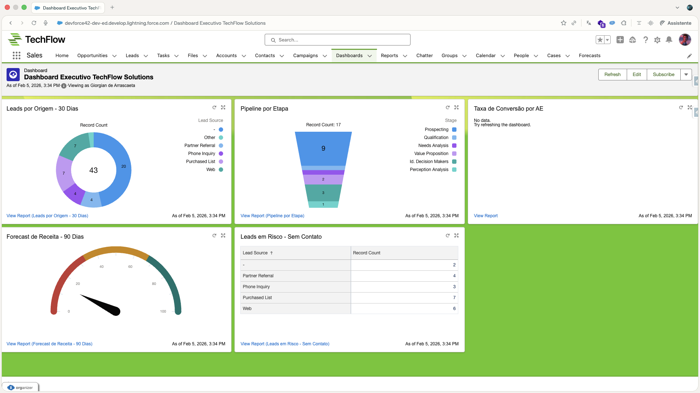
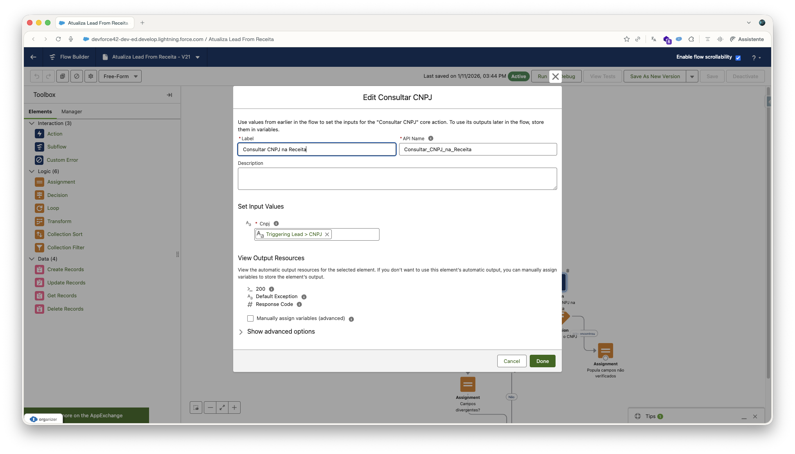
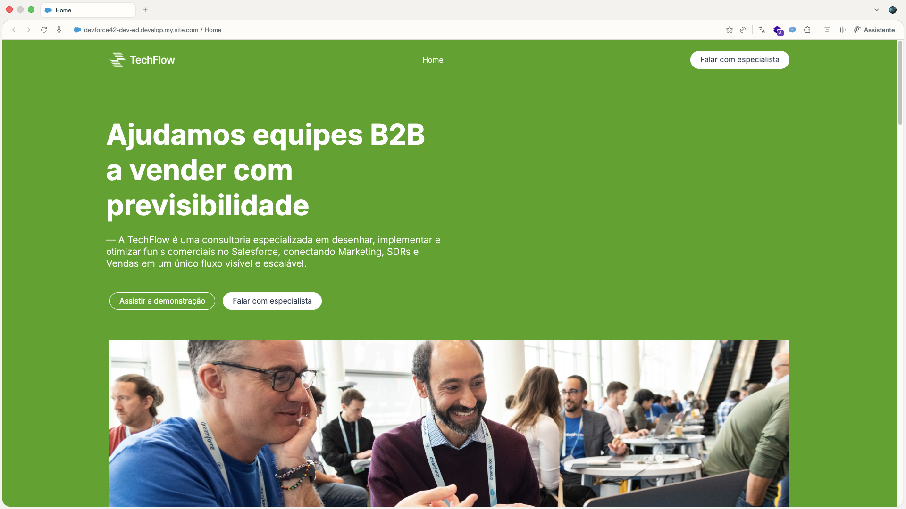
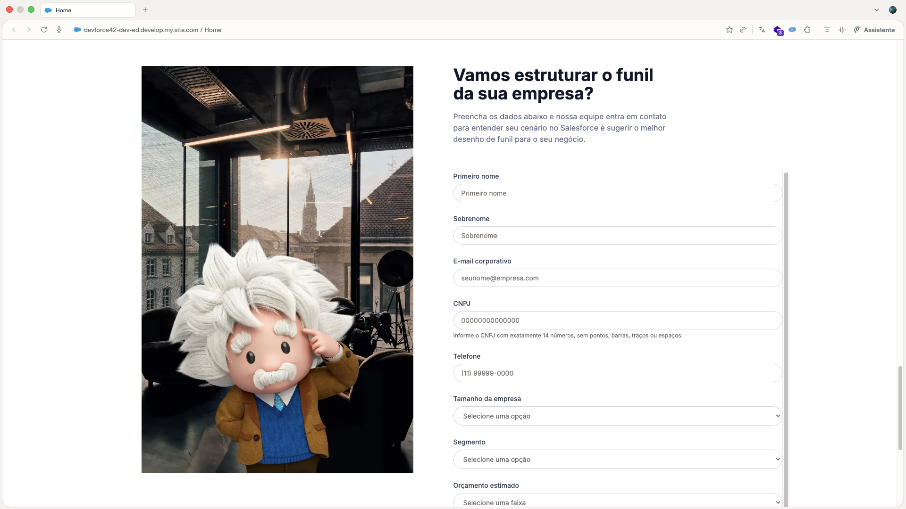

# High-Performance Salesforce Automation Framework
*Padronização e automação de processos CRM para operações B2B.*

## 📖 O Cenário
Empresas B2B em fase de escala costumam enfrentar desafios comuns: processos manuais que geram gargalos, dados incompletos no CRM e necessidade de uma estrutura de segurança que suporte o crescimento do time.

Este projeto foca em transformar o Salesforce em uma ferramenta que trabalha a favor do vendedor, garantindo que o dado chegue limpo e o processo siga um fluxo lógico e auditável.

---

## 🛠️ Módulos da Solução

### 1. Captura e Enriquecimento de Dados
**O Problema:** Entrada de leads com informações insuficientes ou CNPJs inválidos, gerando retrabalho para o time de pré-vendas (SDR).
**A Solução:** Implementação de captura via **Web-to-Lead** integrada à API da **ReceitaWS**.
- **O que foi feito:** Configurei automações que consultam a API no momento da criação do lead para validar o CNPJ e preencher automaticamente campos de endereço, tamanho da empresa e segmento.
- **Racional:** Redução do tempo gasto em pesquisa manual e garantia de integridade desde o primeiro contato.

### 2. Automação do Funil de Vendas
**O Problema:** Falta de padrão no avanço das oportunidades e esquecimento de campos obrigatórios para o faturamento.
**A Solução:** Motor de avanço automático de estágios baseado em requisitos de dados.
- **O que foi feito:** Desenvolvi fluxos (Flows) que monitoram o preenchimento de campos específicos. Quando o vendedor completa uma tarefa real (ex: marcar um checkbox de proposta enviada), o sistema valida os dados e avança o estágio da oportunidade sozinho.
- **Racional:** Garante que o funil reflita a realidade e que o histórico de datas de cada etapa seja registrado para auditoria.

### 3. Camada de Segurança e Integrações
**O Problema:** Necessidade de proteger credenciais de acesso e restringir a visibilidade de dados sensíveis entre diferentes níveis do time.
**A Solução:** Modelo de segurança baseado em papéis e gerenciamento centralizado de credenciais.
- **O que foi feito:** Utilizei **Named Credentials** e **External Credentials (OAuth 2.0)** para gerenciar a autenticação com a API externa sem expor chaves no código. No nível de acesso, configurei **OWD como Privado**, hierarquia de papéis e **Permission Sets** específicos para SDRs e Executivos de Contas.
- **Racional:** Manutenção centralizada da segurança e garantia de que cada usuário veja apenas o necessário para sua função.

### 4. Monitoramento e KPIs
**O Problema:** Dificuldade em visualizar a performance do time e prever o fechamento de novos negócios.
**A Solução:** Painéis de indicadores atualizados em tempo real.
- **O que foi feito:** Criei relatórios e fórmulas para acompanhar a **Taxa de Conversão por AE** e o **Forecast de 90 dias** (ponderado pela probabilidade de cada estágio).
- **Racional:** Substituição de acompanhamentos manuais por dashboards que permitem decisões baseadas no estado atual do pipeline.

---

## 📊 Visual Insights

### 🔹 Painel de Performance
Acompanhamento de métricas de saúde do pipeline e conversão.

### 🔹 Automação de Processos
Exemplo da lógica de fluxo que gerencia as etapas de venda.

### 🔹 Experiência do Cliente
Landing page nativa para captura de leads.

### 🔹 Estrutura de Captura
Formulário com validações integradas.

---

## ⚙️ Stack Utilizada
- **Salesforce:** Sales Cloud, Experience Cloud, Flow Builder.
- **Integração:** REST API (JSON), Named Credentials, OAuth 2.0.
- **Segurança:** OWD, Role Hierarchy, Permission Sets, Field History Tracking.
- **Ferramentas de Apoio:** Salesforce CLI, Git/GitHub, Manifestos XML (package.xml).

---

## 👨‍💻 Autor
**Rhuann Gomes**  
